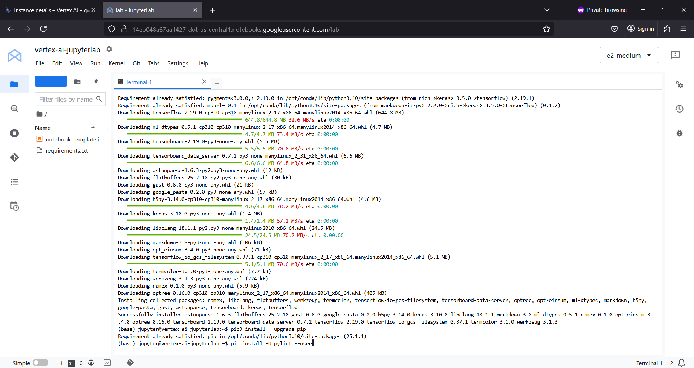
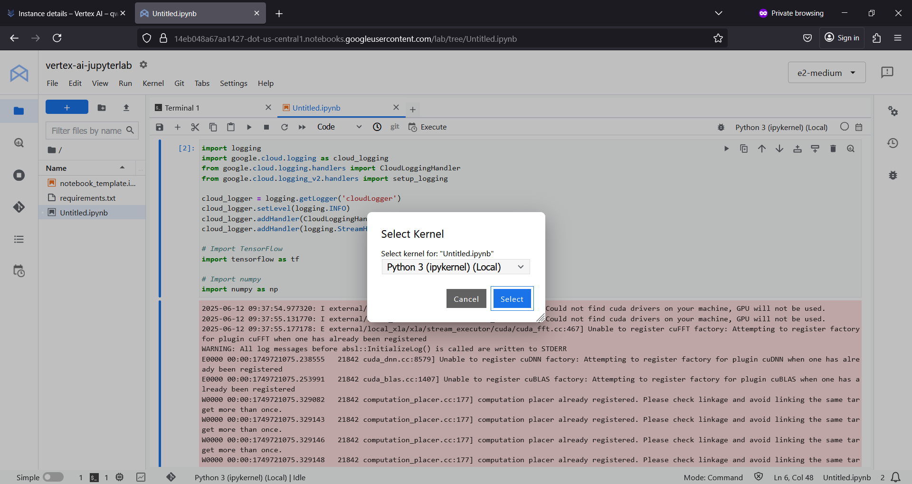
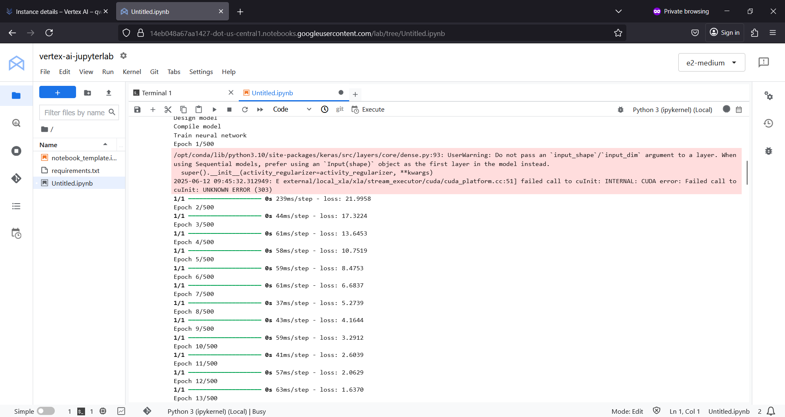
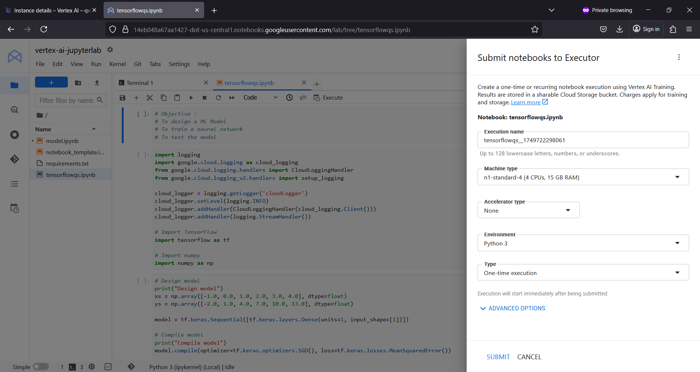

# febqml
febqml : Feature Engineering # BigQuery ML

## Objective
To utilize feature engineering to improve model that predicts fare amount for taxi ride in NYC.

## BigQuery ML Feature Engineering 

